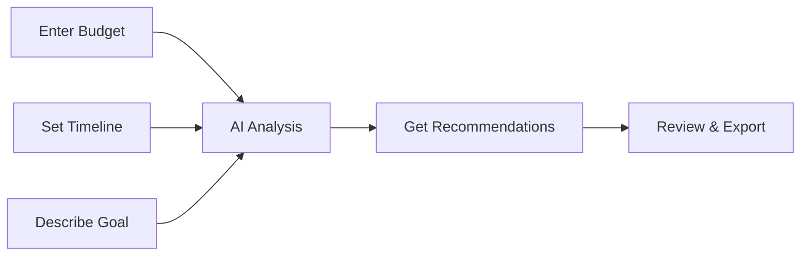

<div align="center">

# ⚡ BuildFast Advisor

### 🚀 AI-Powered No-Code Tool Recommender

**Get instant, personalized no-code tool recommendations in 5 seconds**

[](https://nextjs.org/)
[](https://www.typescriptlang.org/)
[](https://tailwindcss.com/)
[](https://groq.com/)
[](LICENSE)

[🌐 Live Demo](#) • [📖 Documentation](#documentation) • [🚀 Quick Start](#quick-start) • [💬 Discussions](https://github.com/henrynkoh/aiplatform2choose/discussions)

---

</div>

## ✨ What is BuildFast Advisor?

**BuildFast Advisor** is an intelligent AI-powered tool that helps entrepreneurs, developers, and creators find the perfect no-code tools for their projects. Simply enter your budget, timeline, and goal, and get instant personalized recommendations with complete implementation plans.

### 🎯 The Problem It Solves

Choosing the right no-code tools is overwhelming:
- ❌ **100+ tools** to research
- ❌ **10-20 hours** of research time
- ❌ **Hidden costs** and limitations
- ❌ **Analysis paralysis** from too many options

### ✅ The Solution

BuildFast Advisor uses **AI** to analyze your needs and provide:
- ⚡ **5-second** recommendations
- 💰 **Budget-aware** suggestions
- 📅 **Realistic** day-by-day plans
- ⚖️ **Honest** pros and cons
- 📊 **One-click** Google Sheets export

---

## 🎨 Features

<div align="center">

### 🧠 AI-Powered Intelligence
Powered by Groq's Llama 3.3 70B model for lightning-fast, accurate recommendations

### 💰 Budget-Conscious
Every recommendation respects your financial constraints - from $0 to $1000+

### ⏰ Time-Optimized
Plans tailored to your timeline - from 3-day MVPs to 30-day comprehensive builds

### 📊 Complete Roadmaps
Not just tool names - get detailed day-by-day implementation plans

### 📋 Comparison Tables
Side-by-side comparison of top 3 options with costs, pros, cons, and use cases

### 📤 Google Sheets Export
One-click export to Google Sheets for project management and collaboration

### 🎨 Modern UI
Beautiful dark gradient design with glassmorphism effects

### 📱 Responsive Design
Works seamlessly on desktop, tablet, and mobile devices

</div>

---

## 🚀 Quick Start

### Prerequisites

- Node.js 18+ installed
- A free Groq API key from [console.groq.com](https://console.groq.com/keys)

### Installation

```bash
# Clone the repository
git clone https://github.com/henrynkoh/aiplatform2choose.git
cd aiplatform2choose

# Install dependencies
npm install

# Set up environment variables
echo "GROQ_API_KEY=your_groq_api_key_here" > .env.local

# Run development server
npm run dev
```

Open [http://localhost:3000](http://localhost:3000) in your browser.

### Get Your Free API Key

1. Visit [console.groq.com/keys](https://console.groq.com/keys)
2. Sign up (free, no credit card)
3. Create API key
4. Add to `.env.local`

**📖 [Complete Setup Guide →](QUICKSTART.md)**

---

## 💡 How It Works

<div align="center">



</div>

### Step-by-Step

1. **Enter Your Budget** 💵
   - Type your available budget in USD
   - Consider both one-time and recurring costs

2. **Set Your Timeline** ⏰
   - Enter number of days available
   - Be realistic about learning curve

3. **Describe Your Goal** 🎯
   - Be specific about what you want to build
   - Include key features and target audience

4. **Get Recommendations** ⚡
   - AI analyzes your inputs (2-5 seconds)
   - Receive personalized tool recommendations

5. **Review & Export** 📊
   - Review comparison tables and day-by-day plans
   - Export to Google Sheets with one click

---

## 📸 Screenshots

<div align="center">

### 🎨 Modern Interface


### 📊 Comparison Tables


### 📅 Day-by-Day Plans


</div>

---

## 🎯 Use Cases

<table>
<tr>
<td width="50%">

### 👔 Entrepreneurs
Launch MVPs quickly without technical expertise

</td>
<td width="50%">

### 🏢 Small Business
Build internal tools and automation workflows

</td>
</tr>
<tr>
<td>

### 🎨 Content Creators
Create apps and websites for your brand

</td>
<td>

### 📚 Students
Learn no-code development through practical projects

</td>
</tr>
<tr>
<td>

### 💼 Non-Technical Users
Build digital products without coding knowledge

</td>
<td>

### 🔧 Developers
Get quick recommendations for client projects

</td>
</tr>
</table>

---

## 📊 Example Output

### Input
```
Budget: $100
Timeline: 7 days
Goal: "a habit tracker app with daily reminders and streak tracking"
```

### Output
```
✅ Best Option: Glide + Google Sheets
✅ Total Cost: $0 (using free plans)
✅ Timeline: 7 days

📊 Comparison Table:
Rank | Tools | Cost | Pros | Cons
1    | Glide | $0   | Easy, fast | Limited features
2    | Bubble| $25  | Powerful   | Steeper learning
3    | Adalo | $50  | Mobile-first| More expensive

📅 Day-by-Day Plan:
Day 1: Setup Google Sheets database
Day 2: Connect Glide and design interface
Day 3-4: Build core features
Day 5: Add reminders
Day 6: Testing
Day 7: Launch!
```

---

## 🛠️ Tech Stack

<div align="center">

| Category | Technology |
|----------|-----------|
| **Framework** | [Next.js 14](https://nextjs.org/) - React framework with App Router |
| **Language** | [TypeScript](https://www.typescriptlang.org/) - Type safety |
| **Styling** | [Tailwind CSS](https://tailwindcss.com/) - Utility-first CSS |
| **AI** | [Groq SDK](https://groq.com/) - Fast LLM API |
| **Markdown** | [react-markdown](https://github.com/remarkjs/react-markdown) - Markdown rendering |

</div>

---

## 📚 Documentation

<div align="center">

| Document | Description | Link |
|----------|-------------|------|
| 📖 **Quick Start** | Get up and running in 5 minutes | [QUICKSTART.md](QUICKSTART.md) |
| 📘 **User Manual** | Complete user guide with examples | [USER_MANUAL.md](USER_MANUAL.md) |
| 🎓 **Tutorial** | Step-by-step learning guide | [TUTORIAL.md](TUTORIAL.md) |
| 🔑 **API Key Setup** | How to get your Groq API key | [GET_API_KEY.md](GET_API_KEY.md) |
| 📑 **Documentation Index** | Complete documentation overview | [DOCUMENTATION_INDEX.md](DOCUMENTATION_INDEX.md) |

</div>

---

## 🎨 Marketing Materials

We've created comprehensive marketing content for multiple platforms:

<div align="center">

| Platform | Content | Location |
|----------|---------|----------|
| 📘 **Facebook** | Posts, ads, stories | [marketing/FACEBOOK.md](marketing/FACEBOOK.md) |
| 📷 **Instagram** | Posts, reels, stories | [marketing/INSTAGRAM.md](marketing/INSTAGRAM.md) |
| 🧵 **Threads** | Thread templates | [marketing/THREADS.md](marketing/THREADS.md) |
| 📝 **Blogger** | Blog post templates | [marketing/BLOGGER.md](marketing/BLOGGER.md) |
| 🌐 **WordPress** | WordPress content | [marketing/WORDPRESS.md](marketing/WORDPRESS.md) |
| 📧 **Newsletter** | Email templates | [marketing/NEWSLETTER.md](marketing/NEWSLETTER.md) |
| ✉️ **Email** | Campaign templates | [marketing/EMAIL.md](marketing/EMAIL.md) |
| 🇰🇷 **Naver Blog** | Korean blog posts | [marketing/NAVER_BLOG.md](marketing/NAVER_BLOG.md) |
| 🇰🇷 **Tistory** | Korean Tistory posts | [marketing/TISTORY.md](marketing/TISTORY.md) |

</div>

---

## 🚀 Deployment

### Deploy to Vercel (Recommended)

[](https://vercel.com/new/clone?repository-url=https://github.com/henrynkoh/aiplatform2choose)

1. Push your code to GitHub
2. Import repository in [Vercel](https://vercel.com)
3. Add `GROQ_API_KEY` in environment variables
4. Deploy!

### Other Platforms

- **Netlify**: [Deploy Guide](README.md#deployment)
- **Railway**: [Deploy Guide](README.md#deployment)
- **Render**: [Deploy Guide](README.md#deployment)

---

## 📈 Project Statistics

<div align="center">


**📊 Code Statistics:**
- **27 files** committed
- **14,000+ lines** of code and documentation
- **9 platforms** of marketing content
- **5 comprehensive** documentation files

</div>

---

## 🎯 Roadmap

- [x] ✅ Core AI recommendation engine
- [x] ✅ Google Sheets export functionality
- [x] ✅ Comprehensive documentation
- [x] ✅ Marketing materials for 9 platforms
- [ ] 🔄 Mobile app version
- [ ] 🔄 Team collaboration features
- [ ] 🔄 Advanced analytics dashboard
- [ ] 🔄 Integration with more AI models
- [ ] 🔄 User accounts and history
- [ ] 🔄 API for developers

---

## 🤝 Contributing

We welcome contributions! Here's how you can help:

1. **Fork** the repository
2. **Create** a feature branch (`git checkout -b feature/amazing-feature`)
3. **Commit** your changes (`git commit -m 'Add amazing feature'`)
4. **Push** to the branch (`git push origin feature/amazing-feature`)
5. **Open** a Pull Request

### Development Guidelines

- Follow TypeScript best practices
- Use meaningful variable names
- Add comments for complex logic
- Test your changes thoroughly
- Update documentation as needed

**📖 [Contributing Guide →](CONTRIBUTING.md)**

---

## 💬 Community

<div align="center">

[💬 Discussions](https://github.com/henrynkoh/aiplatform2choose/discussions) • [🐛 Report Bug](https://github.com/henrynkoh/aiplatform2choose/issues) • [💡 Request Feature](https://github.com/henrynkoh/aiplatform2choose/issues)

</div>

---

## 📝 License

This project is licensed under the **MIT License** - see the [LICENSE](LICENSE) file for details.

---

## 🙏 Acknowledgments

- **Groq** for providing fast, free AI API access
- **Next.js Team** for the amazing framework
- **Tailwind CSS** for the utility-first CSS framework
- **Open Source Community** for inspiration and support

---

## ⭐ Show Your Support

If you find this project helpful, please give it a ⭐ on GitHub!

<div align="center">

### 🚀 Ready to Build Faster?

**[Get Started Now →](QUICKSTART.md)** | **[View Documentation →](DOCUMENTATION_INDEX.md)** | **[Try Live Demo →](#)**

---

**Built with ❤️ using Next.js, TypeScript, and Groq AI**

[⬆ Back to Top](#-buildfast-advisor)

</div>
